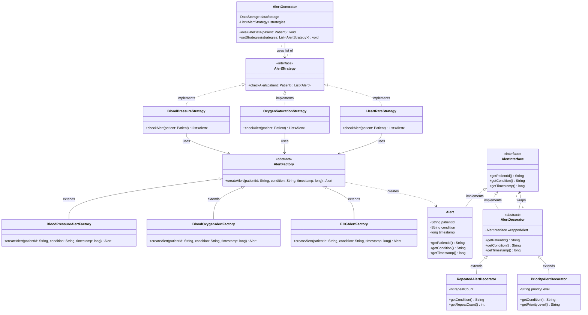
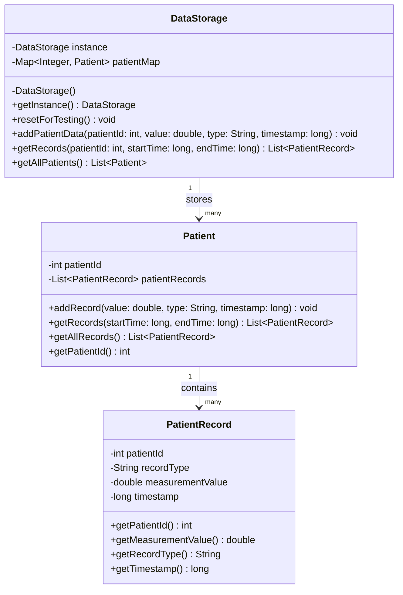
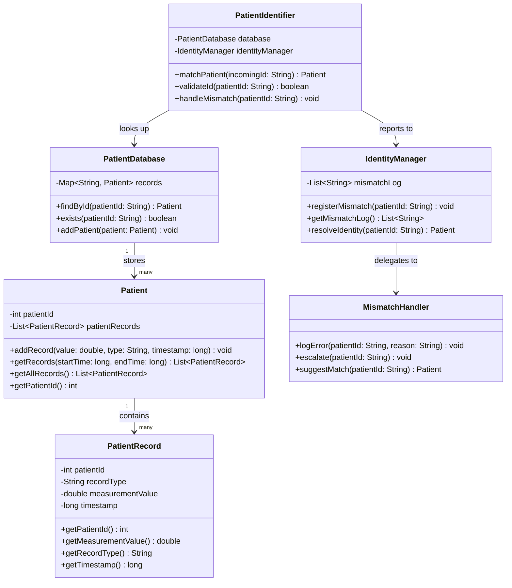
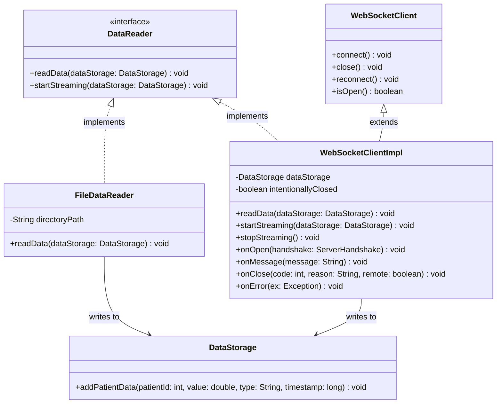

# UML Models - Cardiovascular Health Monitoring System (CHMS)

This document contains four UML class diagrams modelling the key subsystems of the CHMS,
along with a written rationale for each design.

---

## 1. Alert Generation System

### Rationale

When evaluateData() is called on AlertGenerator, it loops through its list of AlertStrategy
objects and calls checkAlert() on each one, collecting the Alert objects they return. Any
alerts that come back get passed to triggerAlert(), which prints them to the console. There
is also a small inline check for manual alerts (record type "Alert", value 1.0) that runs
directly in evaluateData() rather than going through a strategy.

Each strategy uses its own AlertFactory subclass to build the alerts it produces.
BloodPressureStrategy uses BloodPressureAlertFactory, OxygenSaturationStrategy uses
BloodOxygenAlertFactory, and HeartRateStrategy uses ECGAlertFactory. The factory prepends a
type prefix to the condition string so it is clear what kind of alert was raised. Because
each strategy only depends on the abstract AlertFactory type, swapping in a different factory
does not require changing the strategy.

Alert and AlertDecorator both implement AlertInterface, which is what makes the decorator
pattern work here. AlertDecorator holds a reference to any AlertInterface object and
delegates all three getter calls to it. RepeatedAlertDecorator overrides getCondition() to
append a repeat count in the format "[Repeated xN]". PriorityAlertDecorator overrides it to
prepend "[PRIORITY]". Because both decorators go through the same interface, they can be
stacked on top of each other in any order, and the outermost one's getCondition() returns the
fully combined string.

---

## 2. Data Storage System

### Rationale

DataStorage is a Singleton. The constructor is private, so nothing outside the class can
create an instance directly. getInstance() creates the object on the first call and returns
the same object on every subsequent call. addPatientData() is declared synchronized, meaning
only one thread can write at a time. This matters because the WebSocket client and any other
data sources run on separate threads and will call addPatientData() concurrently.

When a new reading arrives, addPatientData() looks up the Patient object by integer ID. If
no Patient exists yet for that ID, it creates one and adds it to the map. Then it calls
addRecord() on the Patient to attach the new PatientRecord. getAllPatients() returns a copy
of the values in the map, so callers cannot accidentally modify the internal storage.

Patient stores its records in an ArrayList. getRecords() filters that list using a stream,
keeping only records whose timestamp falls between startTime and endTime inclusive. This is
used throughout the alert strategies to pull only the relevant type of reading for a patient.
getAllRecords() returns everything without any time filter and is mainly used in tests.

PatientRecord holds exactly one measurement: a type string (for example "SystolicPressure"
or "ECG"), a double value, and a millisecond timestamp. It also stores the patient ID so the
record is self-contained and can be passed around without needing the Patient object.

resetForTesting() sets the singleton field to null so that each unit test starts with a
completely empty DataStorage rather than inheriting data from a previous test.

---

## 3. Patient Identification System

### Rationale

This diagram shows how an incoming data reading gets matched to the correct patient record.
PatientIdentifier is the entry point. When a reading arrives, it calls validateId() to check
the format before doing anything else. If the ID looks valid, it calls findById() on
PatientDatabase to get the matching Patient object. If nothing comes back, it passes the ID
to handleMismatch() rather than silently dropping the reading.

Patient and PatientRecord here reflect the actual implementation. Patient holds an int
patientId and a list of PatientRecord objects. addRecord() creates a new PatientRecord and
appends it to that list. getRecords() filters the list by timestamp range with inclusive
boundaries on both ends, so callers get back exactly the records that fall inside the window
they ask for. getPatientId() returns the int ID so other classes can identify which patient
a record belongs to.

PatientRecord is a plain value object. It stores the patient ID, a record type string, a
numeric measurement value, and a millisecond timestamp. All four fields are set in the
constructor and exposed through getters. Nothing in PatientRecord changes after construction.

PatientDatabase acts as a registry that maps IDs to Patient objects. Keeping this separate
from the main DataStorage means identity lookups do not go through the same path as data
writes, which keeps the two concerns independent.

IdentityManager tracks cases where an ID could not be matched. When it cannot resolve an
identity automatically, it hands the problem to MismatchHandler, which can log the error,
alert staff, or suggest a close match based on partial information.

---

## 4. Data Access Layer

### Rationale

DataReader is an interface with two methods. readData() is for one-shot reads where the
caller blocks until all data has been loaded. startStreaming() is for real-time sources that
run continuously. The interface provides a default no-op implementation of startStreaming(),
so FileDataReader does not need to override it.

FileDataReader takes a directory path in its constructor and scans that directory for .txt
files when readData() is called. For each file it finds, it reads line by line and parses the
format "patientId, timestamp, label, value". Lines with the wrong number of fields, a
non-numeric patient ID, or a non-numeric value are skipped with a warning message. The read
continues for all remaining lines rather than stopping on the first error.

WebSocketClientImpl connects to a WebSocket server to receive patient data in real time. It
extends the Java-WebSocket library's WebSocketClient class to get the underlying connection
handling, and it also implements DataReader so it can be used anywhere a DataReader is
expected. Calling startStreaming() connects to the server and returns immediately. Data then
arrives asynchronously through onMessage(), which splits the message on commas, checks that
there are exactly four fields, parses the patient ID and value as numbers, and calls
addPatientData() on DataStorage. Any message that does not fit that format gets logged and
skipped. If the server closes the connection without the client asking it to, onClose() calls
reconnect(). If the application itself closes the connection by calling stopStreaming(), the
intentionallyClosed flag is set first so onClose() knows not to reconnect.
