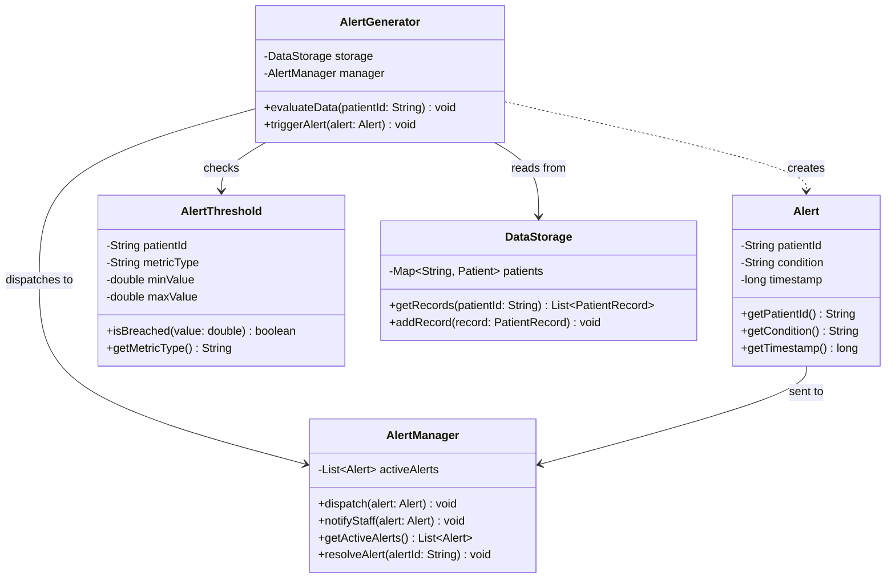
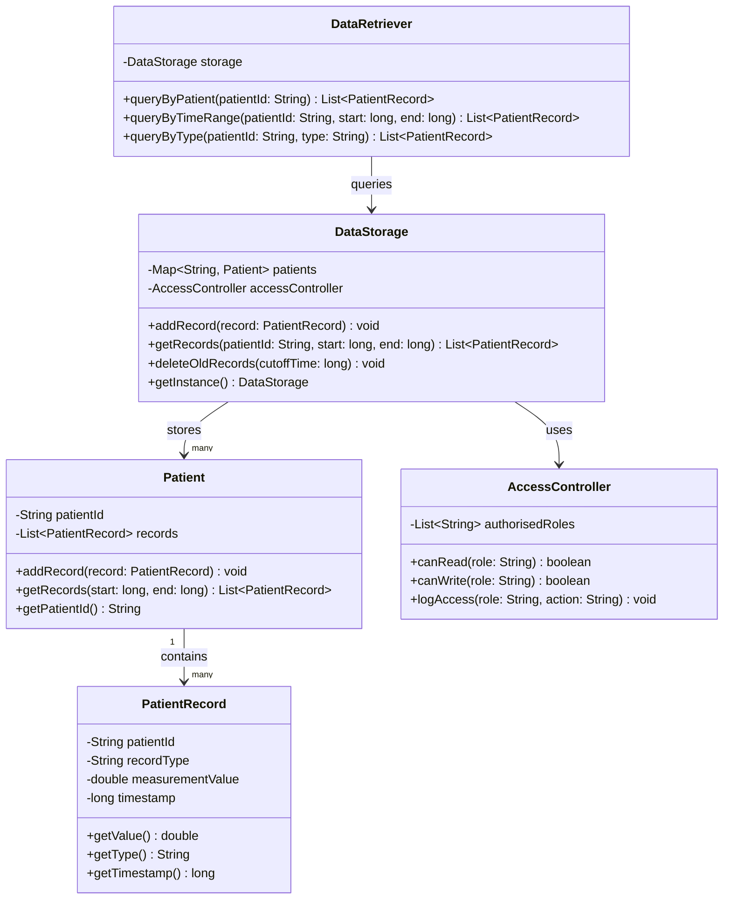
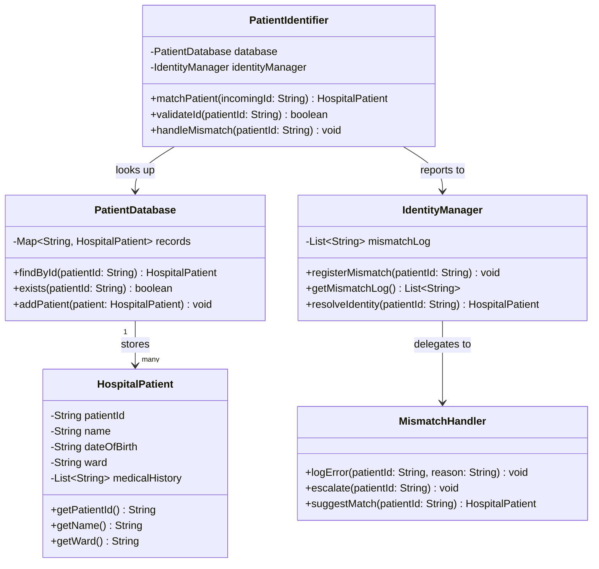
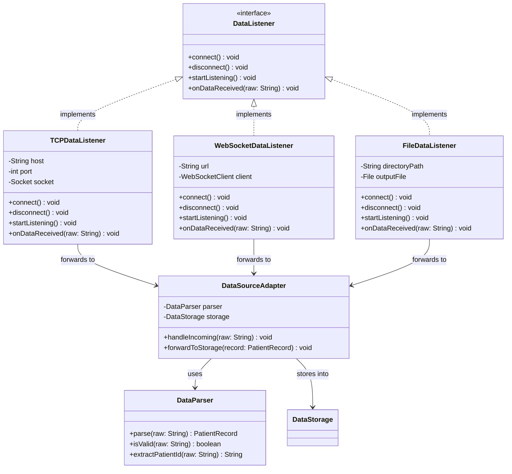

# UML Models - Cardiovascular Health Monitoring System (CHMS)

This document contains four UML class diagrams modelling the key subsystems of the CHMS,
along with a written rationale for each design.

---

## 1. Alert Generation System

### Rationale

The Alert Generation System is responsible for checking incoming patient data and sending
alerts to medical staff when something looks wrong. The design is split into five classes,
each doing its own specific job so nothing gets too complicated.

`AlertGenerator` is the main class of this subsystem. It connects to both `DataStorage` (to
get patient records) and `AlertManager` (to send out alerts). The `evaluateData` method is
where everything starts. It reads the records for a patient, checks them against the defined
thresholds, and calls `triggerAlert` if something is wrong. Keeping all this logic in one
place makes it easier to update later if needed.

`AlertThreshold` stores the alert rules for each patient, like a heart rate limit that is
specific to one patient. Instead of writing those limits directly into `AlertGenerator`, we
put them in their own class so new rules can be added without touching the evaluation logic.
The `isBreached` method handles the actual comparison, which keeps things clean.

`Alert` is basically just a container. It holds the patient ID, what condition was detected,
and when it happened. Keeping it simple means it can be passed around between classes easily.

`AlertManager` takes care of notifying the medical staff and keeping track of active alerts.
By separating this from `AlertGenerator`, the two parts can be changed independently. For
example, how staff get notified (email, screen, pager) can be changed inside `AlertManager`
without breaking anything in `AlertGenerator`.

`DataStorage` is included here to show how this subsystem connects to the data storage
subsystem described in diagram 2.

---

## 2. Data Storage System

### Rationale

The Data Storage System is responsible for safely storing all incoming patient records and
making them available for both real-time monitoring and looking back at historical data. The
design focuses on keeping data organised, secure, and easy to clean up over time.

`DataStorage` is the main class here and is set up as a singleton using `getInstance`, which
means only one instance of it exists across the whole application. This keeps the data
consistent everywhere. It maps patient IDs to `Patient` objects and uses `AccessController`
to handle permissions. The `deleteOldRecords` method removes data older than a set time,
which stops the system from running out of memory.

`Patient` groups all the records for one person together. Instead of dumping everything into
one big list, organising records by patient makes it much faster to find what you need. The
`getRecords` method lets you filter by a time range, which is useful for spotting trends.

`PatientRecord` represents one single measurement at a specific point in time, like a blood
pressure reading. It only stores what is actually needed: the patient ID, the type of
reading, the value, and the timestamp. Keeping it simple makes it easy to work with.

`DataRetriever` gives medical staff a way to query data without touching the internal storage
logic directly. This means the storage structure can change later without breaking how staff
access data.

`AccessController` controls who can read or write data and logs every access. Patient data is
very sensitive, so having a dedicated class for this makes sure access checks cannot be
skipped by accident.

---

## 3. Patient Identification System

### Rationale

The Patient Identification System makes sure that every data reading coming from the signal
generator gets matched to the correct patient record. Getting this wrong in a hospital setting
could be really dangerous, so the design puts a lot of focus on validation and handling errors
properly.

`PatientIdentifier` is the starting point for this subsystem. Every time a new reading comes
in, it calls `matchPatient` to find the right `HospitalPatient` in the database. It also has
a `validateId` method to check that the incoming ID looks correct before even trying to look
it up. If no match is found, it calls `handleMismatch` instead of just throwing the data away
quietly.

`HospitalPatient` holds the actual hospital record for a patient, including their name, date
of birth, ward, and medical history. This class is only read from in this subsystem, never
written to. The identification layer should not be changing patient records.

`PatientDatabase` is where all the hospital patient records are stored. It is kept separate
from `DataStorage` on purpose because patient identity and patient measurements are two
different things. Mixing them together would make the code harder to manage and less secure.

`IdentityManager` keeps track of any mismatches that happen and tries to sort them out. By
putting this logic in its own class rather than inside `PatientIdentifier`, it is easier to
review and audit what went wrong.

`MismatchHandler` deals with the tricky edge cases, like logging what went wrong, alerting
staff about unresolved issues, and suggesting possible matches when there is partial data.
Keeping this separate makes `IdentityManager` simpler and easier to maintain.

---

## 4. Data Access Layer

### Rationale

The Data Access Layer is basically the connector between the external signal generator and the
rest of the CHMS. Its job is to hide how data actually arrives, whether that is TCP, WebSocket,
or a file, so the rest of the system does not have to care about those details.

`DataListener` is an interface that defines four methods all listeners must have: `connect`,
`disconnect`, `startListening`, and `onDataReceived`. All three listener classes implement
this, which means any other part of the system only needs to know about `DataListener` and not
the specifics of each transport type. This also makes it easy to add a new data source in the
future without changing anything else.

`TCPDataListener` handles data coming in over a TCP connection. `WebSocketDataListener`
handles WebSocket connections, which is directly relevant to parts 4 and 5 of this project.
`FileDataListener` reads from the file output that the simulator generates when you use the
`--output file:<dir>` argument. Each listener only stores the fields it actually needs for its
own transport type.

`DataParser` is a shared class that takes the raw string data from any of the listeners and
turns it into a proper `PatientRecord` object. Having one class handle all the parsing means
the format is always consistent no matter where the data came from, and you only need to write
and test the parsing logic once.

`DataSourceAdapter` sits in between the listeners and `DataStorage`. It takes the raw data,
passes it to `DataParser`, checks the result is valid, and then saves it to `DataStorage`.
This keeps transport logic, parsing, and storage all nicely separated from each other.
